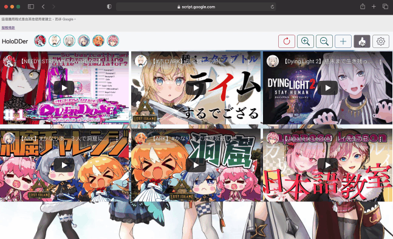

# HoloDDer
Watching, rating multiple YouTube livestreams of Hololive with Google Apps Script.

Darenimo Daisuki !(誰にも大好き!😻 )

Background Image Credit: [twitter@tsuru_py](https://twitter.com/tsuru_py/status/1467466242391175171)

### About
We can use it for watching multiple livestreams of Hololive members, or add other YouTube video for watching at the same time. The script will check schedule info on Hololive official website.

The project root has 2 main folders with source code: cloud & local. I made a cloud version for demo, everyone can use it with a Google account. The cloud demo will remember user configuration with a unique hash ID on Google cloud spreadsheet when CLICK "save" button. It `NEVER` keep your email address or other private info.

Check the demo [>>here<<](https://script.google.com/macros/s/AKfycbywEBw2_-AJ5I04qP1EiVUyzWzxRuZEnHTqJeF7hrj8QRQ_bmTWv6R1aZKGXdY-7ddh/exec)

### Setting
1. Create a new Apps Script project on Google Drive
2. Create all files the same as content of folder "local"
3. Add [Cheerio library](https://github.com/tani/cheeriogs)
    [Script ID] : 1ReeQ6WO8kKNxoaA_O0XEQ589cIrRvEBA9qcWpNqdOP17i47u6N9M5Xh0
4. Add [SubTube library](https://github.com/laplacetw/Apps-Script-SubTube)
    [Script ID] : 15wcYYK_3nUaq9UpCzYh_fNSomaSF0MVNXi2bWRqeb6AUenpHk6UWihnR
5. Add YouTube Data API Service
6. Deploy as a web application for yourself
- [Overview of Google Apps Script](https://developers.google.com/apps-script/overview)

### How to use
1. Check and save tracking list with "setting" modal (popup window)
2. We can also set an awesome fan-art background image with URL
3. Get / Update the livestream data through the 🔄 &nbsp;button
4. It will check and display all livestreams currently according to tracking list 
5. Add other YouTube livestream/video manually with the "add" modal
6. Control the video display / hidden with avatar icon on the top of page

---
### Change Log
2022-02-10
#### Added
- Add `ホロライブ` and `ホロスターズ` checkboxes to tracking list
#### Fixed
- Livestream tracking of `Ninomae Ina'nis` was skipped since the VTuber name of official schedule info has changed from `Ina'nis` to `Ina`
- Livestream tracking of `Roboco` was skipped since the VTuber name of official schedule info has changed from `ロボ子` to `ロボ子さん`
- Livestream tracking of `Watson Amelia` was skipped since the VTuber name of official schedule info has changed from `Ame` to `Amelia`

2022-02-05
#### Added
- Rating button for YouTube video (YouTube Data API)
#### Changed
- Build the [SubTube](https://github.com/laplacetw/Apps-Script-SubTube) library for fetching YouTube video info
- Using Properties Service for user config saving instead of local storage
#### Note
- The rating button doesn't record our rating history, just for quick rating

2022-01-19
#### Fixed
- Fixed the hidden video didn't stop playing

2022-01-18
#### Added
- "Setting" modal
- "Add Video" modal
- Keep user configuration in local storage
- Keep valid avatar URLs in local storage for saving [quota](https://developers.google.com/apps-script/guides/services/quotas) usage
#### Changed
- Display channel avatar of video which is added additionally instead of default avatar
- Improve the UI/UX
#### Fixed
- The video which added additionally by user is not exist after livestream data update

2021-12-21
#### Changed
- Using CSS for livestreams display control instead of Vue list rendering
#### Fixed
- Unnecessary re-rendering for livestreams display control and stopping many livetreams afterwards

2021-12-16
#### Added
- Boostrap@5.1.1
- Cheerio as html parser
- Avatar area of VTuber for stream(iframe) display control
#### Changed
- [YouTube Data API](https://developers.google.com/youtube/v3/getting-started) is deprecated due to the big cost of search
- Get livestreams data from [Hololive.tv](https://schedule.hololive.tv) directly
- Improve the UI/UX
#### Fixed
- Avatar tooltip not working after livestreams data update