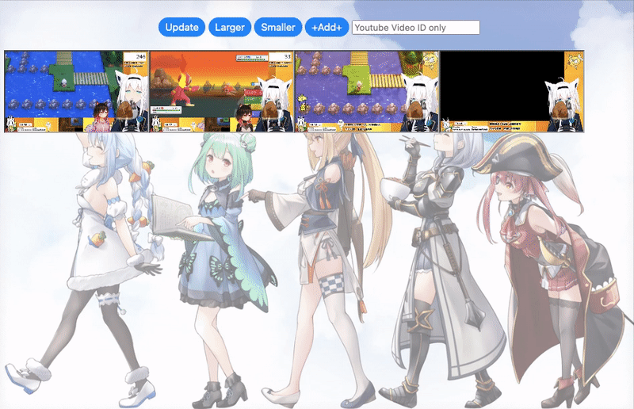

# HoloDDer
A Google Apps Script tool for everyone who loves Hololive.

### Setting
1. Create a new App Script project on Google Drive
2. Copy and paste the content of mycode .gs to your .gs file
3. Create a new .html file which the same  as my index.html (copy&paste)
4. Add YouTube Data API v3 service
5. Deploy as a web application
- [Overview of Google Apps Script](https://developers.google.com/apps-script/overview)

### How to use
1. Notice the cost of [YouTube API Quota](https://developers.google.com/youtube/v3/getting-started#quota). We have 10,000 units per day but cost 100 units for [searching](https://developers.google.com/youtube/v3/docs/search/list) with every channel ID in "holoChID".
2. Feel free to modify your "holoChID" contents
3. We can update the livestream videos but cost channel IDs * 100 units
4. Or add more videos manually through the input field which beside the "Add" button
5. Please input video IDs only (separate with space)

### Demo
- Background Image Credit: [twitter@tsuru_py](https://twitter.com/tsuru_py/status/1467466242391175171)

