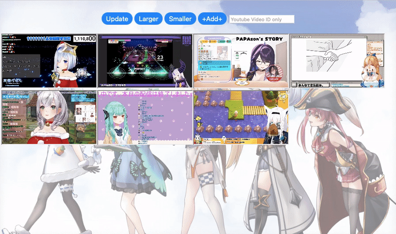

# HoloDDer
A Google Apps Script for everyone who loves Hololive. Darenimo Daisuki ! (誰にも大好き!😻 )

Background Image Credit: [twitter@tsuru_py](https://twitter.com/tsuru_py/status/1467466242391175171)

### Setting
1. Create a new App Script project on Google Drive
2. Copy and paste the content of my "code .gs" to your "code .gs" file
3. Copy and paste the content of my "index .html" to your "index .html" file (you must create it first)
4. Add [Cheerio library for Google Apps Script](https://github.com/tani/cheeriogs)
 [Script ID] : 1ReeQ6WO8kKNxoaA_O0XEQ589cIrRvEBA9qcWpNqdOP17i47u6N9M5Xh0
5. Deploy as a web application
- [Overview of Google Apps Script](https://developers.google.com/apps-script/overview)

### How to use
1. Feel free to modify "holoChID" in "code .gs"
2. HoloDDer will check and display all livestreams of VTuber in "holoChID"
3. Get/Update the livestream data through the 🔄 &nbsp;button 
4. Add video manually through the input field and "Add" button

---
### Change Log
2021-12-16
#### Added
- Boostrap@5.1.1
- Cheerio as html parser
- Avatar area of VTuber for stream(iframe) display control
#### Changed
- [YouTube API](https://developers.google.com/youtube/v3/getting-started) is deprecated due to the big cost of search
- Get livestreams data from [Hololive.tv](https://schedule.hololive.tv) directly
- Improve the UI/UX
#### Fixed
- Avatar tooltip not working after livestreams data update